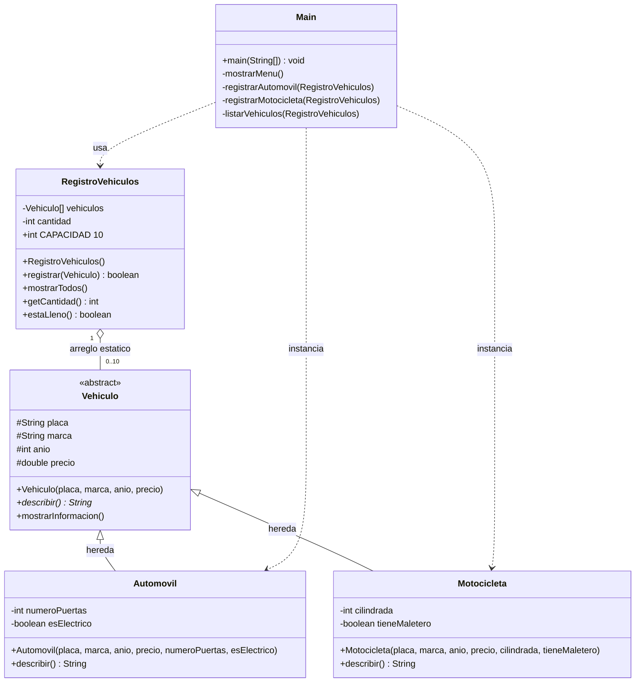

# Diagrama de clases - TDA Registro de Vehículos

El TDA `RegistroVehiculos` guarda hasta **10** referencias de tipo `Vehiculo`. Los objetos reales son `Automovil` o `Motocicleta`. `Main` presenta el menú, recibe datos e instancia esas clases hijas.

## Lectura del diagrama

| Relación | Qué representa |
|---|---|
| `Vehiculo <|-- Automovil` y `Vehiculo <|-- Motocicleta` | **Herencia.** Las hijas reutilizan placa, marca, año y precio. |
| `describir()` marcado como abstracto (`*`) en `Vehiculo` | **Polimorfismo.** Cada hija lo sobrescribe con `@Override`. |
| `RegistroVehiculos o-- Vehiculo` (0..10) | **Arreglo estático** `new Vehiculo[10]`. Guarda referencias, no el tipo concreto. |
| `Main ..> Automovil` y `Main ..> Motocicleta` | **Instanciación.** El menú hace `new Automovil(...)` y `new Motocicleta(...)`. |
| Atributos `#` en `Vehiculo` y `-` en las hijas y el TDA | **Encapsulamiento.** `protected` en la clase base y `private` en el resto. |
| `int`, `double` y `boolean` | **Datos primitivos** pedidos en el enunciado. |

## Responsabilidades

| Clase | Paquete | Responsabilidad |
|---|---|---|
| `Vehiculo` | `modelo` | Clase abstracta con los atributos comunes. |
| `Automovil` | `modelo` | Clase hija con número de puertas y estado eléctrico. |
| `Motocicleta` | `modelo` | Clase hija con cilindrada y maletero. |
| `RegistroVehiculos` | `negocio` | TDA que administra el arreglo estático. |
| `Main` | `app` | Presenta el menú, recibe datos e instancia objetos. |
