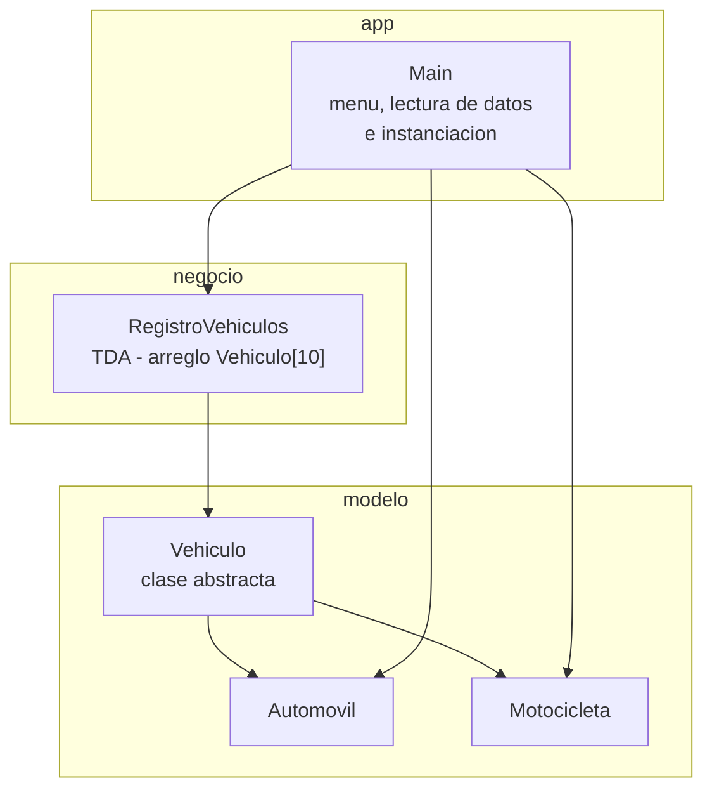
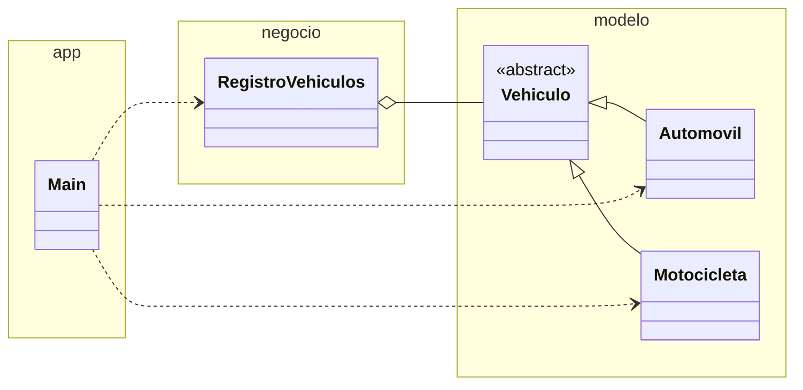

# Diagrama de paquetes - TDA Registro de Vehículos

Arquitectura en tres capas, igual en Java (`src/`) y en C++ (`CPP/`).

## Dependencias entre carpetas

| Capa | Contiene | Depende de |
|---|---|---|
| `modelo/` | `Vehiculo`, `Automovil`, `Motocicleta` | nada |
| `negocio/` | `RegistroVehiculos` | `modelo` |
| `app/` | `Main` | `modelo` y `negocio` |

`negocio` trabaja solo con el tipo `Vehiculo`. El tipo concreto (`Automovil` o `Motocicleta`) lo decide `Main` al instanciar, y el TDA lo trata de forma polimórfica.
